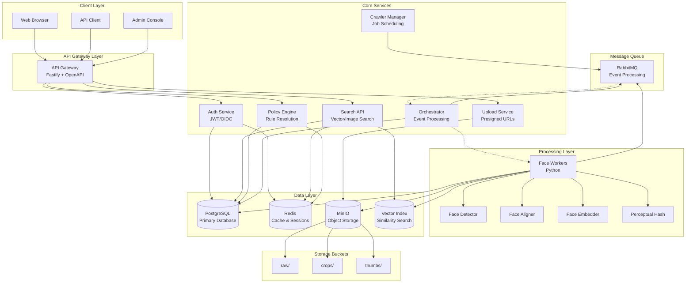
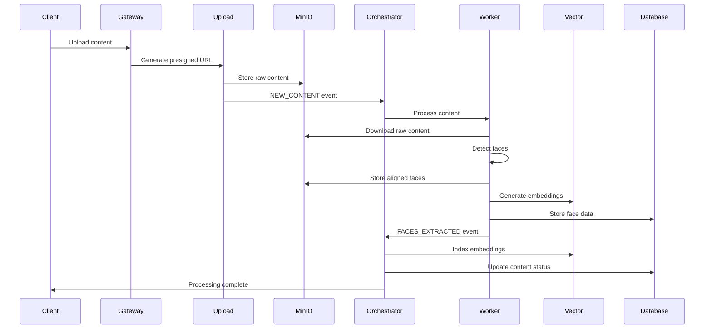
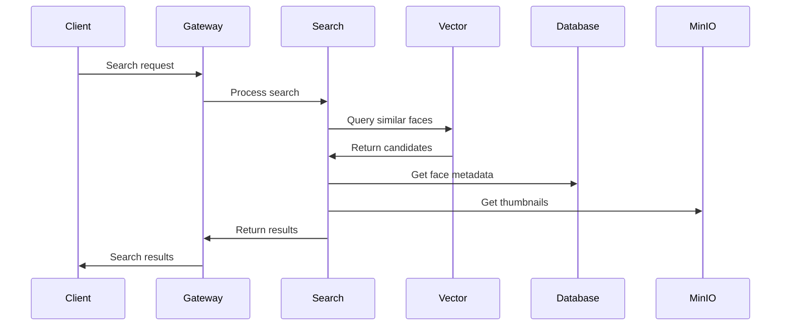
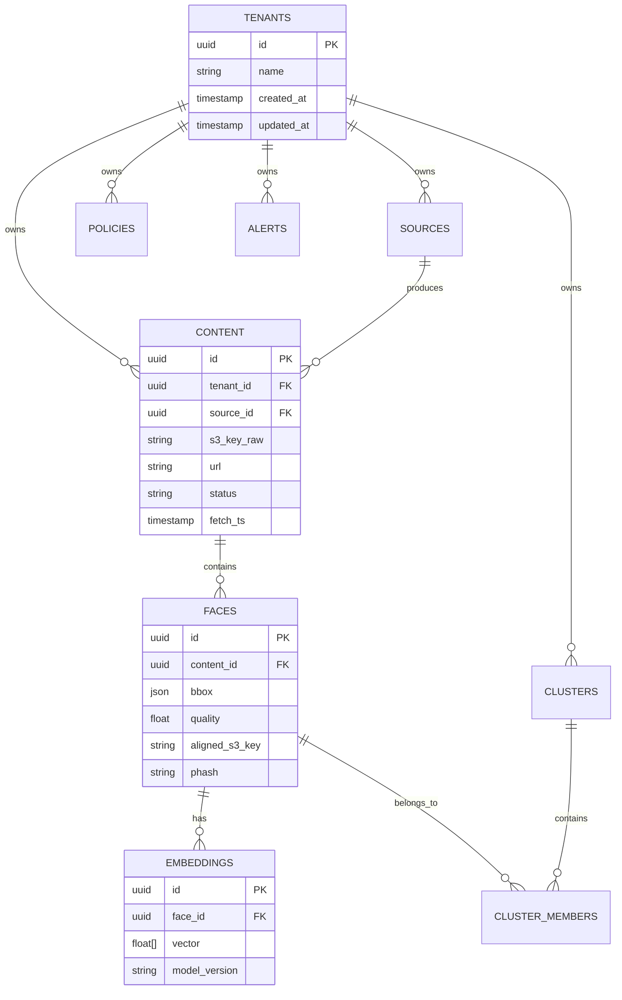

# Mordeaux Face Protection System - Architecture

## System Overview

The Mordeaux Face Protection System is a comprehensive platform for face detection, recognition, and protection across multiple content sources. The system is designed as a microservices architecture with clear separation of concerns and scalable components.

## Architecture Diagram

## Service Architecture

### API Gateway
- **Technology**: Fastify with TypeScript
- **Responsibilities**:
  - Request routing and load balancing
  - Rate limiting and WAF rules
  - OpenAPI documentation
  - Authentication middleware
  - CORS and security headers

### Authentication Service
- **Technology**: Fastify with JWT
- **Responsibilities**:
  - JWT token issuance and validation
  - OIDC integration (production)
  - User session management
  - Token refresh handling

### Upload Service
- **Technology**: Fastify with MinIO client
- **Responsibilities**:
  - Presigned URL generation
  - File upload validation
  - Content type verification
  - S3-compatible storage integration

### Search API
- **Technology**: Fastify with vector search
- **Responsibilities**:
  - Image-based face search
  - Vector similarity search
  - Search result ranking
  - Filter and pagination

### Policy Engine
- **Technology**: Fastify with rule engine
- **Responsibilities**:
  - Policy resolution by tenant
  - Rule evaluation
  - Access control decisions
  - Policy versioning

### Face Workers
- **Technology**: Python with async processing
- **Responsibilities**:
  - Face detection and extraction
  - Face alignment and normalization
  - Embedding generation
  - Perceptual hashing
  - Batch processing

### Orchestrator
- **Technology**: Fastify with message queues
- **Responsibilities**:
  - Event processing and routing
  - Workflow orchestration
  - Error handling and retries
  - Dead letter queue management

## Data Flow

### Content Processing Pipeline

### Search Flow

## Database Schema

### Core Entities

- **Tenants**: Multi-tenant organization structure
- **Sources**: Content sources (crawlers, uploads, APIs)
- **Content**: Processed content items with metadata
- **Faces**: Detected faces with bounding boxes and quality scores
- **Embeddings**: 512-dimensional face embeddings
- **Clusters**: Face clusters for grouping similar faces
- **Policies**: Tenant-specific access control rules
- **Alerts**: System alerts and notifications

### Relationships

## Security Architecture

### Authentication & Authorization
- JWT-based authentication for development
- OIDC integration for production
- Role-based access control (RBAC)
- Tenant isolation and data segregation

### Data Protection
- Encryption at rest (MinIO, PostgreSQL)
- Encryption in transit (TLS/HTTPS)
- Secure key management
- Audit logging for all operations

### Network Security
- Service-to-service authentication
- Network segmentation
- Rate limiting and DDoS protection
- WAF rules for API protection

## Scalability Considerations

### Horizontal Scaling
- Stateless service design
- Load balancer ready
- Database connection pooling
- Message queue clustering

### Performance Optimization
- Redis caching layer
- Database indexing strategy
- Vector search optimization
- Async processing with queues

### Monitoring & Observability
- Health check endpoints
- Structured logging with request IDs
- Metrics collection (Prometheus)
- Distributed tracing (OpenTelemetry)

## Deployment Architecture

### Development Environment
- Docker Compose for local development
- Hot reload for rapid iteration
- Mock services for external dependencies
- Comprehensive logging and debugging

### Production Environment
- Kubernetes deployment
- Service mesh (Istio)
- External load balancer
- Managed databases and storage
- CI/CD pipeline with automated testing

## Technology Stack

### Backend Services
- **Runtime**: Node.js 18+ with TypeScript
- **Framework**: Fastify for high-performance APIs
- **Database**: PostgreSQL 15 with JSON support
- **Cache**: Redis 7 for session and data caching
- **Message Queue**: RabbitMQ for async processing
- **Object Storage**: MinIO (S3-compatible)

### Face Processing
- **Runtime**: Python 3.9+
- **ML Libraries**: OpenCV, dlib, face_recognition
- **Vector Search**: Custom in-memory implementation
- **Processing**: Async workers with queue processing

### Frontend
- **Framework**: React 18 with TypeScript
- **Build Tool**: Vite for fast development
- **UI Library**: Modern component library
- **State Management**: React Query for server state

### Infrastructure
- **Containerization**: Docker with multi-stage builds
- **Orchestration**: Docker Compose (dev), Kubernetes (prod)
- **Monitoring**: Prometheus + Grafana
- **Logging**: Structured JSON logs with ELK stack
